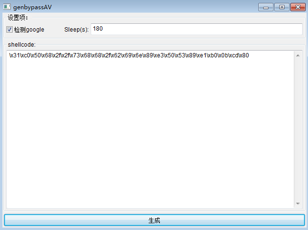

# 使用方法
   安装nim与gcc环境

## 生成可执行文件
```shell
   nimble install
```

## 交叉编译
   适用于linux下编译供windows使用的genbypass.exe,
   在linux下使用genbypass生成bypass.exe只需要安装mingw编译器,可以忽略下面的步骤。

   linux下使用mingw交叉编译，先安装mingw编译器,然后指定mingw进行编译:
```shell
   nimble build -d:release -d:mingw --passC:-D_FORTIFY_SOURCE=0
```
   注意nigui交叉编译时会出现链接路径错误，windows路径无法在linux下使用,需要修改
   ~/.nimble/pkgs/nigui-0.2.4/nigui/private/windows/platform_impl.nim文件,
   使用replace替换\为/
```nim
when defined(cpu64):
  {.link: (currentSourcePath().parentDir() / "manifest_x64.res").replace("\\", "/") .}
else:
  {.link: (currentSourcePath().parentDir() / "manifest_x86.res").replace("\\", "/") .}
```

## 调用命令行
   可以从剪贴板，或从文件输入shellcode,生成bypass.exe可执行文件，

   命令行启动:
```shell
genbypass -h

generate bypass code

Usage:
  genbypass [options] 

Options:
  -f, --file=FILE            input shell code file, hex string format
  -c, --clipboard            get shell code from clipboard
  -g, --google               if host can connect google, then quit.
  -s, --sleep=SLEEP          sleep x seconds then start shellcode. (default: 180)
  -h, --help                 Show this help
```
   使用-g参数，添加google访问检测
   
   -s 200 指定执行shellcode前等待200秒。

## 使用gui界面
   如果不指定任何参数，默认启动gui界面:
   
   
　　
